<h1>Project 6 Final Project: Covid Tracker</h1>

<h2>Introduction</h2>

This is the last and final project for the Udacity Nanodegree iOS Developer.

The final project is where the Student, in this case myself, decides what project to embark on.

I created an App to track the number of Worldwide cases of Covid-19 by Country.

The API source for it, is the free API that the team of Postman (www.postman.com) have place to help Organizations to better track the spread of Corona Virus.

<h2>Desription</h2>
<h3>Views</h3>

For this project I have used the Tab Views, to split between two other views.

One using Swift MapView, and the other the TableView.

<h3>Data Persistence</h3>

For data persistence I have used realm, which the dependencies were installed thru cocoapods.

<h3>TableView Swipe Action</h3>

For the TableView Swipe Action, a package called SwipeCellKit created by Mohammad Kurabi was used. The package was loaded into the project using cocoapods.

<h3>API Call</h3>

For the Corona Virus Cases, the App pulls data from an API call into postman, https://documenter.getpostman.com/view/10808728/SzS8rjbc?version=latest

A big shout-out for the Postman Team for putting this free API access to all.

<h2>Screens</h2>
<h3>MapView Screens</h3>

  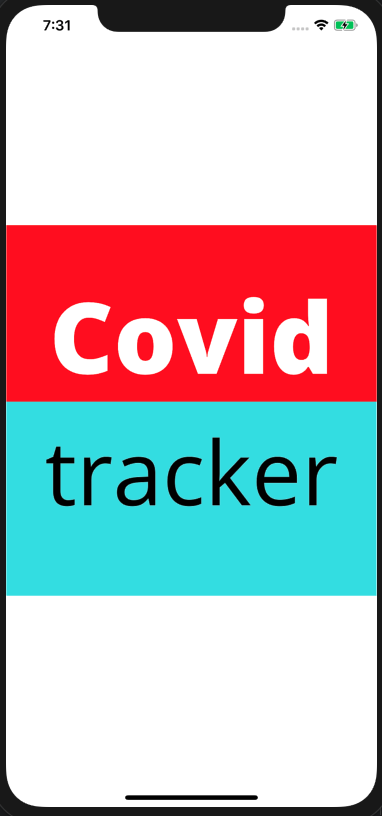
  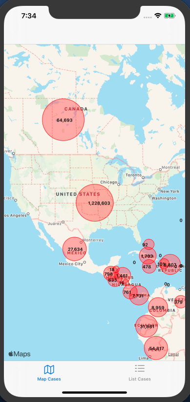
  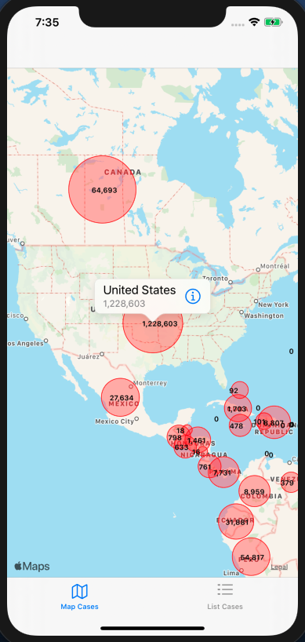
  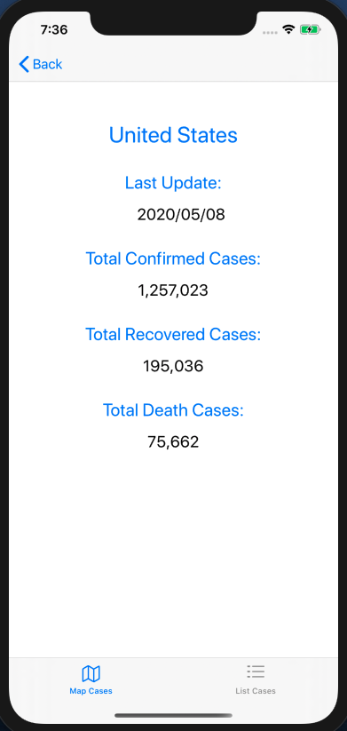

<h3>TableView Screens</h3>

  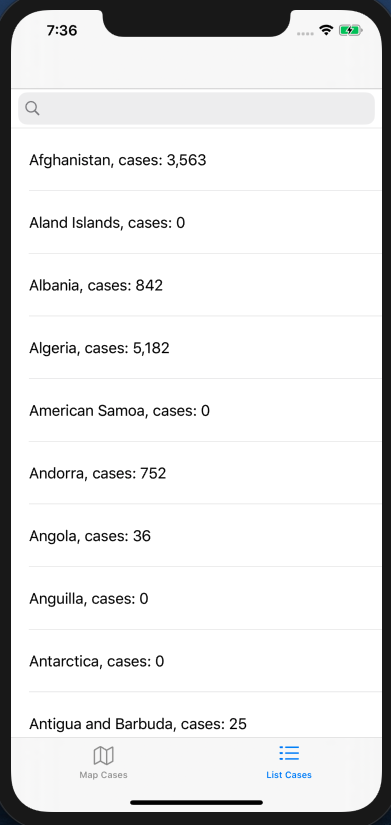
  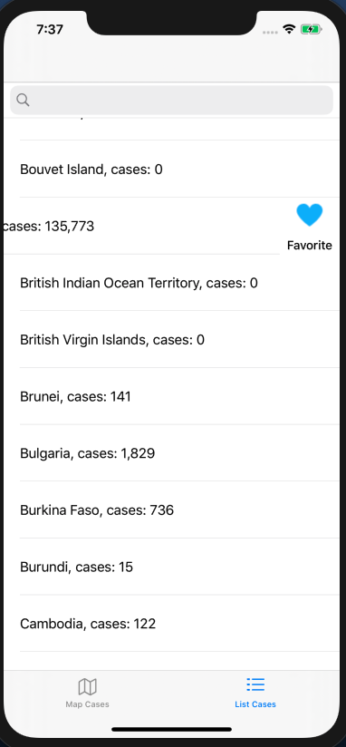
  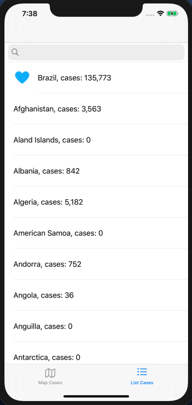
  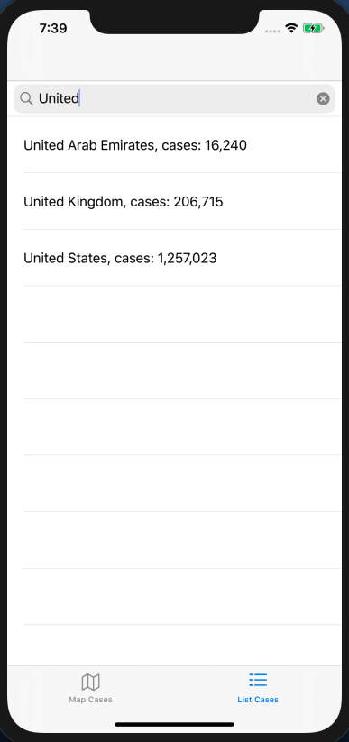

<h3>TableView Screens</h3>

  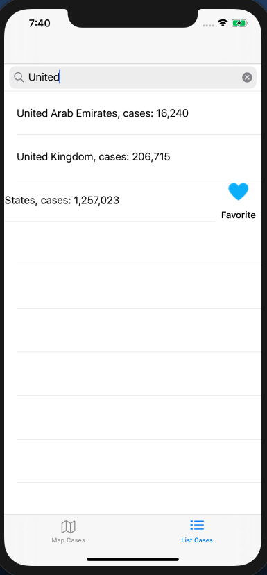
  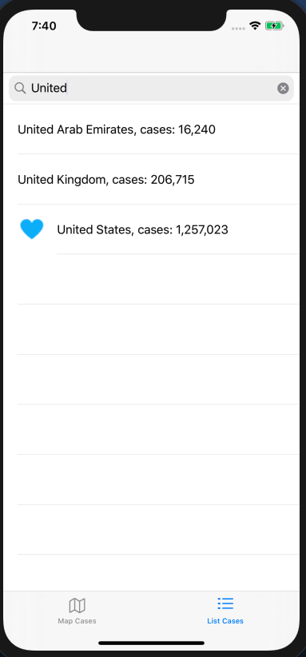
  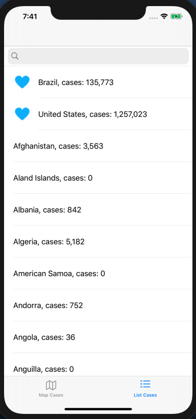
  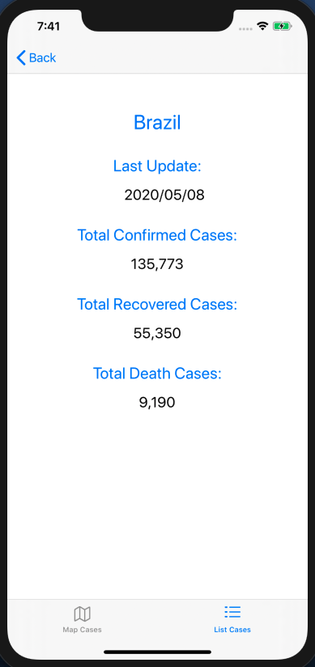

