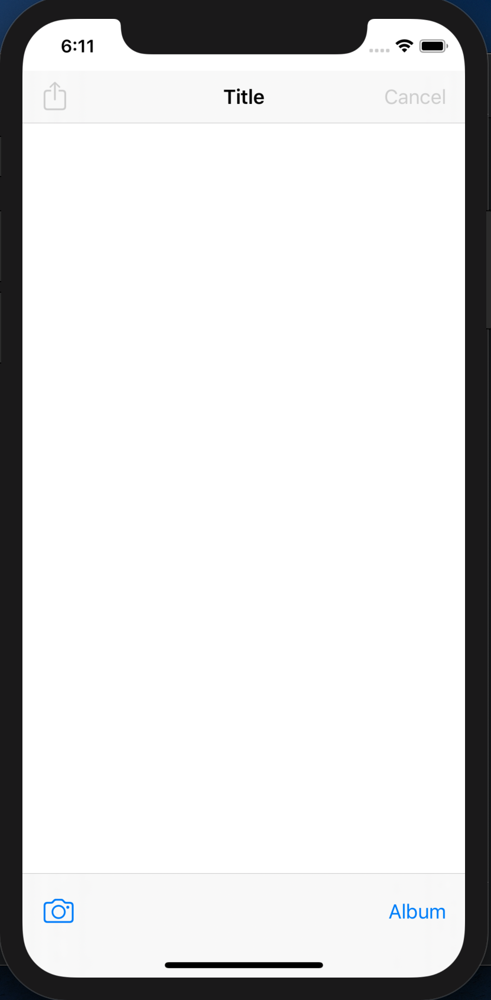
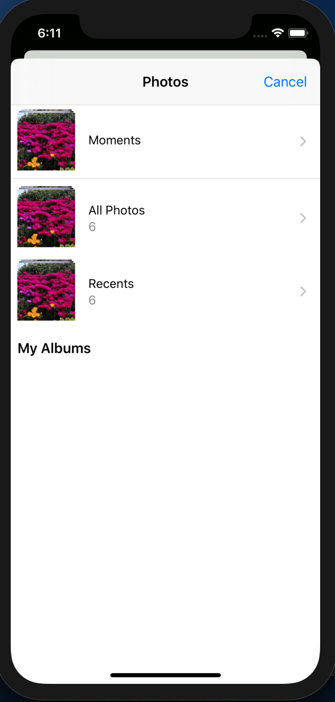
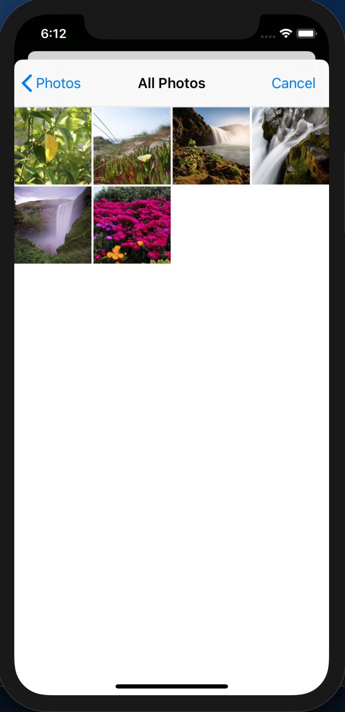
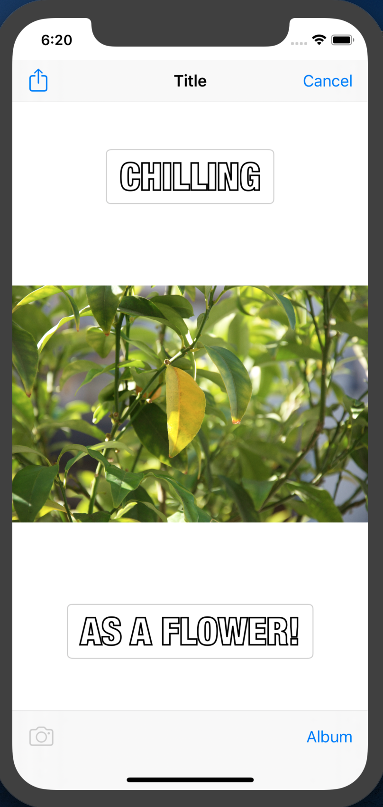
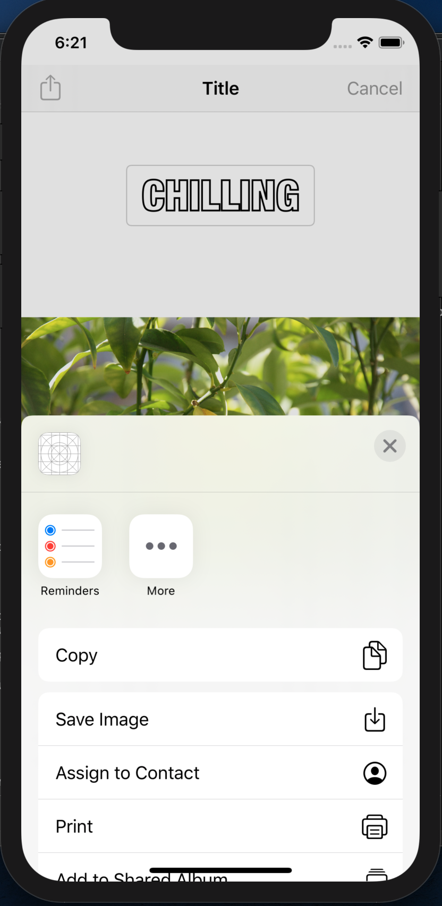
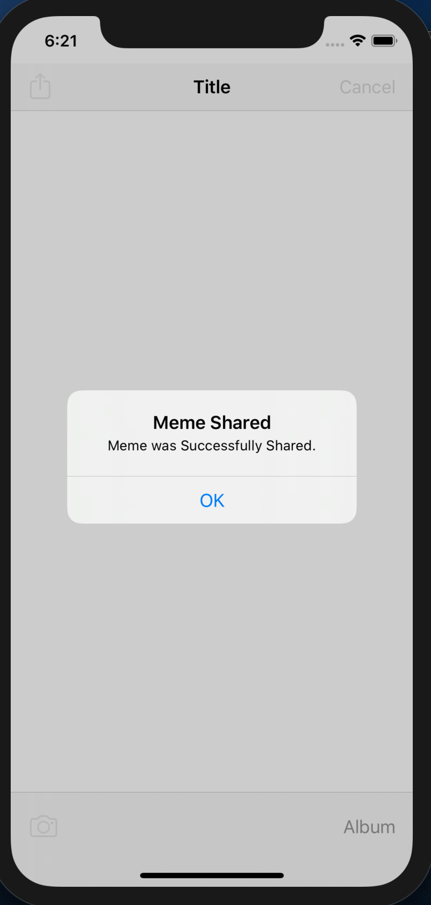

<h1>Project 2: Meme 1.0</h1>

<h3>Introduction</h3>

Meme is an iOS Application where the User can take a Picture with the Photo or Select an Existing Picture from his/her Phone Gallery, and Produce Amazing Memes to share with Friends and Family.

<h3>Screens</h3>

  
  
  
  
  
  

