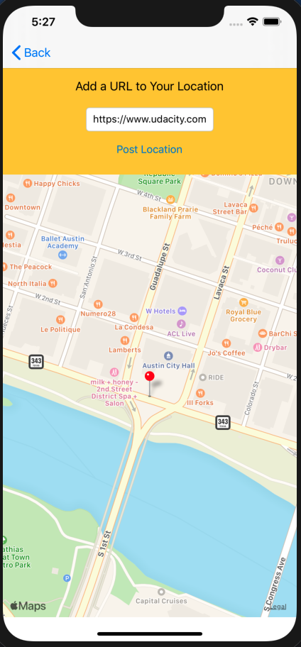

<h1>Project 4: On The Map</h1>

<h3>Introduction</h3>

On The Map is an iOS Application where the User can take a place a location in a map, with a URL link.

The generated location will be available back on the map or on a list format.

<h3>Screens</h3>

  
  
  
  
  

