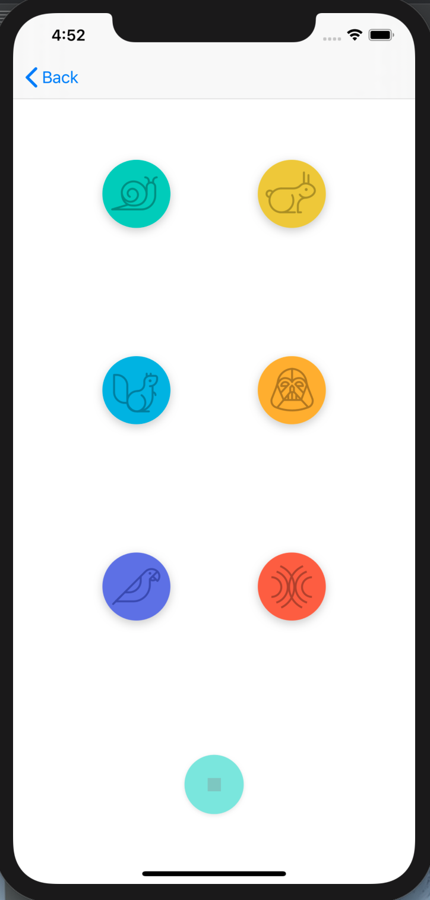

<h1>Project 1: Pitch Perfect</h1>

<h3>Introduction</h3>

Pitch Perfect is an iOS Application where the User can record his/her voice, and play the recorded sound with different modulations.

<h3>Six Options Modulations are available:</h3>
<ul>
<li>Snail (Slow)</li>
<li>Rabbit (Fast)</li>
<li>Squirrel (High Pitch)</li>
<li>Darth Vader (Low Pitch)</li>
<li>Bird (Eco)</li>
<li>Sounds (Reverb)</li>
</ul>

<h3>Screens</h3>

  
  

