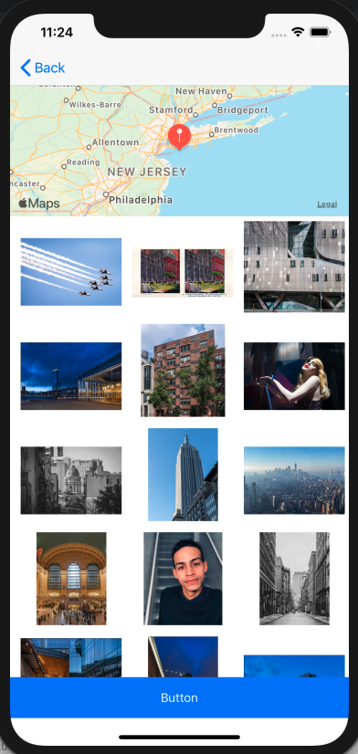

<h1>Project 5: Virtual Tourist</h1>

<h2>Introduction</h2>

This is the Project 5, Virtual Tourist, part of Udacity Nanaodegree in iOS Developement.

On this app, the user is able to place a pin over a map, and query pictures at the nearby location. The Pictures come from Flickr.

<h2>Concepts</h2>

This application covers topics such as Data Persistence, and API Calls.

<h3>Data Persistence</h3>

For the Data Persistence, Core Data was implemented.

<h3>API Call</h3>

For the Pictures, API call was implemented to get pictures from Flickr.

<h2>Screens</h2>

  
  
  

